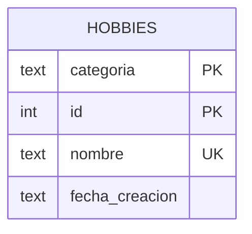

# Base de Datos

## Visión General

MiHobbyC usa **SQLite3** como motor de base de datos, embebido directamente en el proyecto. La BD se almacena localmente y se crea automáticamente en la primera ejecución.

## Ubicación

```
%LOCALAPPDATA%\MiHobbyC\data\hobbies.db
```

Si `LOCALAPPDATA` no está disponible, usa:
```
%USERPROFILE%\AppData\Local\MiHobbyC\data\hobbies.db
```

## Configuración

| Parámetro | Valor | Descripción |
|-----------|-------|-------------|
| Journal Mode | WAL | Write-Ahead Logging para concurrencia |
| Foreign Keys | ON | Habilitadas para integridad referencial |
| Encoding | UTF-8 | Codificación por defecto de SQLite |

## Esquema

### Tabla `hobbies`

```sql
CREATE TABLE IF NOT EXISTS hobbies (
    categoria    TEXT NOT NULL,
    id           INTEGER NOT NULL,
    nombre       TEXT NOT NULL UNIQUE,
    fecha_creacion TEXT NOT NULL DEFAULT '',
    PRIMARY KEY (categoria, id)
);
```

### Descripción de Columnas

| Columna | Tipo | Restricciones | Descripción |
|---------|------|---------------|-------------|
| `categoria` | TEXT | NOT NULL, PK | Nombre de la categoría |
| `id` | INTEGER | NOT NULL, PK | ID secuencial dentro de la categoría |
| `nombre` | TEXT | NOT NULL, UNIQUE | Nombre del hobby |
| `fecha_creacion` | TEXT | NOT NULL, DEFAULT '' | Fecha ISO 8601 de creación |

### Clave Primaria Compuesta

La clave primaria es `(categoria, id)`. Esto significa:
- Cada categoría tiene su propia secuencia de IDs (1, 2, 3, ...)
- El mismo ID puede existir en diferentes categorías
- La combinación (categoria, id) es única

### Restricción UNIQUE

La columna `nombre` tiene restricción UNIQUE global. No pueden existir dos hobbies con el mismo nombre en toda la base de datos, sin importar la categoría.

## Diagrama ER



## Datos Iniciales

La tabla se crea vacía. Las categorías y hobbies se crean desde la interfaz de usuario.

## Migraciones

### Migración 1: Columna `fecha_creacion`

**Fecha:** Versión 2.0.0

**Problema:** La versión 1.0 no tenía columna de fecha.

**Solución:**

```sql
-- Verificar si la columna existe
PRAGMA table_info(hobbies);

-- Agregar columna si falta
ALTER TABLE hobbies ADD COLUMN fecha_creacion TEXT NOT NULL DEFAULT '';

-- Rellenar fechas basadas en el ID
UPDATE hobbies
SET fecha_creacion = datetime('2020-01-01', '+' || (id - 1) || ' days')
WHERE fecha_creacion = '';
```

**Resultado:** Todos los registros existentes obtienen una fecha calculada desde `2020-01-01`.

## Registros Placeholder

### Propósito

Para que una categoría exista sin tener hobbies reales, se inserta un registro placeholder con:

```sql
INSERT INTO hobbies (id, nombre, categoria, fecha_creacion)
VALUES (1, 'MiCategoria [nuevo]', 'MiCategoria', datetime('now', 'localtime'));
```

### Exclusión en Consultas

Los placeholders se excluyen de todas las consultas de usuario con:

```sql
WHERE nombre NOT LIKE '% [nuevo]'
```

### Constante

```c
#define HOBBY_PLACEHOLDER " [nuevo]"
```

## Consultas Principales

### Listar Categorías (con conteo)

```sql
SELECT categoria, COUNT(*)
FROM hobbies
WHERE nombre NOT LIKE '% [nuevo]'
GROUP BY categoria
ORDER BY categoria;
```

### Listar Hobbies de una Categoría

```sql
SELECT nombre
FROM hobbies
WHERE categoria = ? AND nombre NOT LIKE '% [nuevo]'
ORDER BY fecha_creacion;
```

### Seleccionar Aleatorio

```sql
SELECT categoria, nombre
FROM hobbies
ORDER BY RANDOM()
LIMIT 1;
```

### Siguiente ID Disponible

```sql
SELECT COALESCE(MIN(a.id), 1) FROM (
    SELECT t.id + 1 AS id FROM hobbies t WHERE t.categoria = ?
    UNION ALL
    SELECT 1
) a
WHERE a.id NOT IN (SELECT id FROM hobbies WHERE categoria = ?);
```

### Conversión Nº→ID

```sql
SELECT id
FROM hobbies
WHERE categoria = ? AND nombre NOT LIKE '% [nuevo]'
ORDER BY fecha_creacion
LIMIT 1 OFFSET ?;
```

## Archivo de Log

**Ubicación:** `%LOCALAPPDATA%\MiHobbyC\data\mihobbyc.log`

**Formato:**
```
[2026-07-21 14:30:00] === Sistema iniciado ===
[2026-07-21 14:30:05] Base de datos abierta: C:\...\hobbies.db
[2026-07-21 14:31:00] CRUD: Crear categoria 'Anime'
[2026-07-21 14:31:15] CRUD: Crear hobby 'Lectura' en Anime
[2026-07-21 14:32:00] Sorteo aleatorio solicitado
[2026-07-21 14:32:00] Hobby seleccionado: Anime: Lectura
[2026-07-21 14:35:00] Base de datos cerrada
[2026-07-21 14:35:00] === Sistema detenido ===
```

**Entradas registradas:**
- Inicio/detención del sistema
- Apertura de la base de datos
- Operaciones CRUD (crear, actualizar, eliminar)
- Sorteos aleatorios
- Errores SQL

## Rendimiento

### Optimizaciones Aplicadas

1. **WAL Journal** — Lecturas concurrentes sin bloqueo
2. **Statements Preparados** — Reutilización de queries parametrizadas
3. **GROUP BY con COUNT** — Una sola query en lugar de N+1
4. **Índice implícito** — La PK compuesta `(categoria, id)` crea un índice automático

### Tamaño Esperado

- Categorías: ~100 bytes cada una
- Hobbies: ~200 bytes cada uno
- Placeholder: ~150 bytes cada uno
- Log: ~1KB por sesión típica

## Integridad de Datos

### Reglas de Negocio

1. Máximo `MAX_POR_CATEGORIA` (5) hobbies por categoría
2. Nombre de hobby único en toda la BD
3. Los placeholders se excluyen de la lógica de negocio
4. Las fechas se asignan automáticamente al crear

### Manejo de Errores

- Todas las queries usan `sqlite3_prepare_v2()` para validación
- Los errores se registran en el log y se muestran en stderr
- Las transacciones se manejan implícitamente por SQLite
